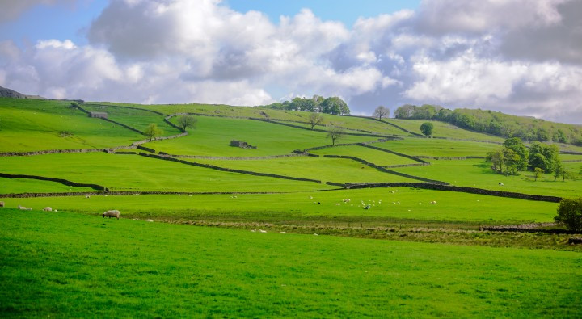
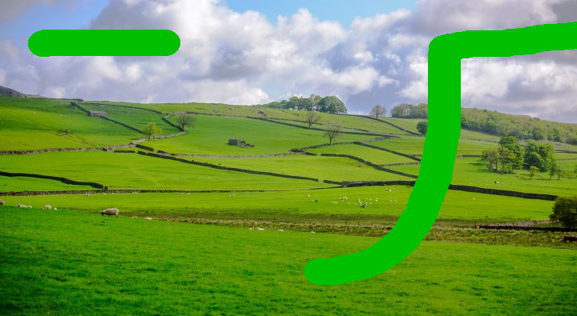
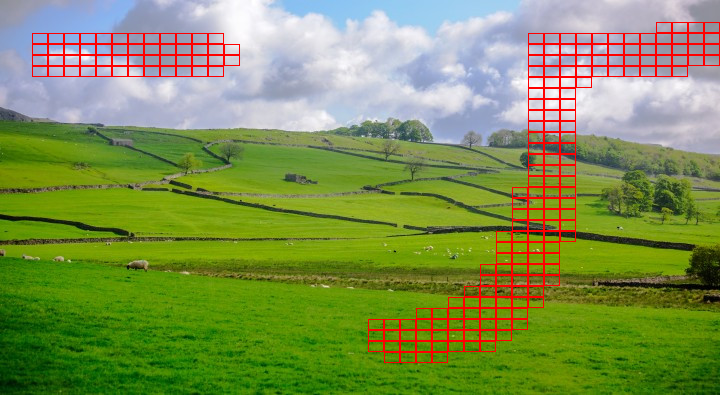

# Comparador de imagem
Está código tem como objetivo fazer a comparação de duas imagens de mesmo tamanho e resolução. Ele destacará as diferenças em uma imagem gerada através da execução do código. 

# Exemplo

### Imagem 1

### Imagem 2 (Rasurada com um rabisco verde)

### Resultado (Retangulos vermelhos mostra onde seria a diferença entre as duas imagens)

